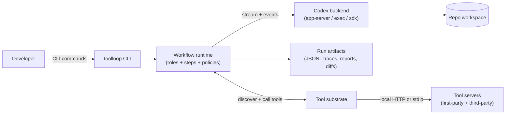

# codex-toolloop

[](https://github.com/BjornMelin/codex-toolloop)
[](./LICENSE)

[](https://nodejs.org)
[](https://www.typescriptlang.org)
[](https://vitest.dev)
[](https://ai-sdk.dev)
[](https://developers.openai.com/codex)
[](https://zod.dev)
[](https://modelcontextprotocol.io)

Local-first coding-agent workflows built on OpenAI Codex and Vercel AI SDK v6.

`codex-toolloop` is a Node.js TypeScript CLI and runtime for building reproducible, multi-step coding-agent workflows: plan, research, implement, test, review, and produce audit-grade run artifacts (traces, diffs, reports). It is designed to integrate tightly with Codex CLI authentication (ChatGPT account usage) while using AI SDK agent patterns for orchestration and future UI integration.

---

## Table of contents

- [codex-toolloop](#codex-toolloop)
  - [Table of contents](#table-of-contents)
  - [Why codex-toolloop](#why-codex-toolloop)
  - [Key features](#key-features)
  - [Architecture](#architecture)
    - [High-level components](#high-level-components)
    - [Feature development run (sequence)](#feature-development-run-sequence)
  - [Quickstart](#quickstart)
    - [Prerequisites](#prerequisites)
    - [Install](#install)
    - [Start local tool servers (optional, recommended)](#start-local-tool-servers-optional-recommended)
    - [Run a workflow](#run-a-workflow)
  - [Usage](#usage)
    - [Commands (overview)](#commands-overview)
    - [Typical workflows](#typical-workflows)
  - [Configuration](#configuration)
    - [Config file](#config-file)
  - [Tooling and integrations](#tooling-and-integrations)
    - [Extensible MCP tool servers](#extensible-mcp-tool-servers)
  - [Backends](#backends)
  - [Run artifacts](#run-artifacts)
  - [Development](#development)
    - [Repo structure](#repo-structure)
    - [Build](#build)
  - [Testing](#testing)
  - [Docs](#docs)
  - [Roadmap](#roadmap)
  - [Contributing](#contributing)
  - [Security](#security)
  - [License](#license)
  - [How to cite](#how-to-cite)
    - [BibTeX](#bibtex)

---

## Why codex-toolloop

If you already use Codex daily, you typically want two things that plain “chat in a terminal” does not reliably provide:

1. **Reusable workflows**: named, parameterized pipelines you can run again (feature dev, audits, migrations).
2. **Tooling discipline**: controlled tool access, consistent context gathering, and inspectable evidence for every action taken.

`codex-toolloop` adds a workflow engine, typed handoffs, policy controls, and an artifact trail around Codex-backed engineering runs.

---

## Key features

- **Workflow engine** for multi-step engineering runs (feature-dev, code review, audit).
- **Multi-agent roles** (planner, researcher, implementer, verifier, reviewer) with strict, typed handoffs.
- **Codex-first execution** with support for:
  - persistent sessions and mid-run course correction (app-server mode)
  - non-interactive automation with JSONL traces and structured output schemas (exec mode)
  - programmatic control via the Codex TypeScript SDK (optional)
- **Type-safe schemas** everywhere (Zod v4) for tool inputs, step outputs, and structured reports.
- **Local-first artifacts**: every run produces a directory of logs and outputs that can be inspected, diffed, and shared.

---

## Architecture

### High-level components



### Feature development run (sequence)


---

## Quickstart

### Prerequisites

- Node.js v24 LTS (runtime; required for AI SDK MCP STDIO transport)
- pnpm (recommended via Corepack)
- Codex CLI installed and authenticated (ChatGPT login or API key)
- Git (recommended)

Codex CLI references:

- CLI reference: <https://developers.openai.com/codex/cli/reference/>
- Non-interactive mode (`codex exec`): <https://developers.openai.com/codex/noninteractive/>
- Codex SDK: <https://developers.openai.com/codex/sdk/>

### Install

```bash
git clone https://github.com/BjornMelin/codex-toolloop
cd codex-toolloop

pnpm install

# verify environment
pnpm dev:cli -- doctor
```

pnpm v10 blocks dependency lifecycle scripts by default. This repo uses a minimal, audited allowlist
in `pnpm-workspace.yaml` (currently `@biomejs/biome` and `esbuild`). If you add dependencies that
require build scripts, update the allowlist (or run `pnpm approve-builds`).

### Start local tool servers (optional, recommended)

```bash
# Planned (SPEC 010 + SPEC 040)
# pnpm dev:cli -- mcp start
```

### Run a workflow

```bash
# Planned (SPEC 030 + SPEC 040)
# pnpm dev:cli -- run spec ./docs/specs/040-cli.md
# pnpm dev:cli -- run workflow feature-dev --approval on-failure --sandbox workspace-write
```

---

## Usage

### Commands (overview)

Current implementation status (SPEC 000): only `doctor` is implemented. Other commands below
are part of the roadmap and are tracked by their corresponding SPECs.

| Command | Purpose |
| --- | --- |
| `codex-toolloop doctor` | Validate environment (node, pnpm, codex) |
| `codex-toolloop mcp start` | Start local tool servers (planned) |
| `codex-toolloop run spec <path>` | Execute a SPEC-driven run (planned) |
| `codex-toolloop run workflow <name>` | Execute a named workflow (planned) |
| `codex-toolloop session list` | List runs, thread IDs, and statuses (planned) |
| `codex-toolloop session inspect <runId>` | Inspect run artifacts and report (planned) |

### Typical workflows

- `feature-dev`: plan -> research -> implement -> verify -> review -> finalize
- `review`: analyze current branch or diff, produce findings and recommendations
- `audit`: deep check for deprecations, API mismatches, and documentation gaps

---

## Configuration

`codex-toolloop` reads a single config file (plus environment variables).

### Config file

Default path (configurable): `./toolloop.config.toml`

```toml
[toolloop]
artifacts_dir = "~/.toolloop/runs"
default_backend = "app-server"

[policies]
approval_mode = "on-failure"          # untrusted | on-failure | on-request | never
sandbox_mode  = "workspace-write"     # read-only | workspace-write | danger-full-access

[tools]
# domain allowlist for network fetching tools (if enabled)
allowed_domains = ["ai-sdk.dev", "developers.openai.com", "vercel.com", "github.com"]

# tool allowlist at the workflow level (optional)
allowed_tools = ["repo.readFile", "repo.listDir", "repo.ripgrep", "docs.fetch"]

[codex]
# codex model alias used by backends
model = "gpt-5.2-codex"

# optional: configure MCP-compatible tool servers here (see next section)
```

---

## Tooling and integrations

Tooling is implemented as a **shared tool substrate (MCP)** that can be discovered and called at runtime. This keeps workflows extensible without hardcoding every capability into the CLI.

Codex ToolLoop uses AI SDK v6 primitives for MCP and dynamic tooling:

- MCP clients via `createMCPClient()` (`@ai-sdk/mcp`)
- Dynamic tools via `dynamicTool()` (for large or evolving tool catalogs)

### Extensible MCP tool servers

You can attach MCP servers to:

- provide repo utilities (search, read, directory listing)
- fetch documentation from allowlisted domains
- connect to third-party tool ecosystems

Key design point: **avoid tool-definition context bloat**.

- Tools are grouped into small **bundles** and loaded on-demand per workflow/role/step (ADR 0009, SPEC 011).
- **Default transport is HTTP** (deployable); **stdio is local-only** and may require Node.js.
- For huge catalogs, we expose only a small set of MCP meta-tools implemented with `dynamicTool()` (SPEC 011) rather than injecting every tool schema.

See:

- ADR 0003: `docs/adr/0003-mcp-tooling.md`
- ADR 0009: `docs/adr/0009-dynamic-tool-loading.md`
- SPEC 010: `docs/specs/010-mcp-platform.md`
- SPEC 011: `docs/specs/011-dynamic-tool-loading.md`

---

## Backends

`codex-toolloop` supports three Codex execution backends behind a single interface.

| Backend | Best for | Notes |
| --- | --- | --- |
| `app-server` (default) | Long, interactive multi-step runs | persistent threads, mid-run injection, event streaming |
| `exec` | Scriptable automation | JSONL traces and `--output-schema` for strict structured output |
| `sdk` (optional) | Programmatic integration | use the Codex TypeScript SDK for thread control |

References:

- App-server provider: <https://ai-sdk.dev/providers/community-providers/codex-app-server>
- Exec non-interactive mode: <https://developers.openai.com/codex/noninteractive/>
- Codex SDK: <https://developers.openai.com/codex/sdk/>
- AI SDK ToolLoopAgent: <https://ai-sdk.dev/docs/reference/ai-sdk-core/tool-loop-agent>

---

## Run artifacts

Every run produces a directory (default: `~/.toolloop/runs/<runId>/`) with:

- `meta.json` (backend, policies, timing, thread id)
- `events.jsonl` (normalized event stream)
- `tool-calls.jsonl` (tool invocations and redacted results)
- `final-report.md` (human-readable report)
- `step-outputs/` (typed JSON outputs per step)
- `diff-summary.md` (what changed)

This is designed for:

- debugging failures
- sharing a run with a teammate
- comparing runs over time
- creating golden tests for workflows

---

## Development

### Repo structure

```text
apps/
  cli/                # CLI entrypoint and streaming UX
packages/
  codex-toolloop/      # runtime: workflows, steps, artifacts, policies
  codex/              # codex backends (app-server, exec, sdk)
  mcp/                # tool substrate + local tool servers
  workflows/          # named workflows and role definitions
  testkit/            # fixtures, temp dirs, mocks
docs/                 # PRD, architecture, ADRs
  specs/              # implementation specs
```

### Build

```bash
pnpm build
```

---

## Testing

Vitest is used for:

- unit tests (pure TypeScript)
- integration tests (mocked Codex and tool servers)
- type-level tests (`expectTypeOf`)

Run tests:

```bash
pnpm test
```

Run typecheck:

```bash
pnpm typecheck
```

---

## Docs

- PRD: `docs/PRD.md`
- Architecture: `docs/architecture.md`
- ADRs: `docs/adr/`
- Specs: `docs/specs/`

---

## Roadmap

- Stable workflow pack: feature-dev, review, audit
- Tool server catalog and discovery UX
- Stronger structured outputs for step boundaries (schema-first)
- Optional local UI (Next.js) for browsing run artifacts and starting runs
- Recording and replay of runs (golden traces)

---

## Contributing

Contributions are welcome.

Recommended flow:

1. Open an issue describing the use case and expected behavior.
2. Add or update a SPEC under `docs/specs/` for non-trivial changes.
3. Add tests (unit or integration) for behavior changes.
4. Keep changes small and focused.

---

## Security

- Default policies aim to be safe for local development:
  - sandbox: `workspace-write`
  - approvals: `on-failure`
- Avoid running with dangerous sandbox modes unless you fully understand the risk.
- Tool outputs are redacted before being written to artifacts where possible.

If you discover a security issue, please open a private report or create a GitHub security advisory (preferred).

---

## License

See [`LICENSE`](./LICENSE).

---

## How to cite

If you use `codex-toolloop` in academic work or technical reports, cite it as software.

### BibTeX

```bibtex
@software{melin_codex_toolloop_2026,
  author  = {Bjorn Melin},
  title   = {codex-toolloop: Local-first coding-agent workflows built on OpenAI Codex and Vercel AI SDK},
  year    = {2026},
  url     = {https://github.com/BjornMelin/codex-toolloop}
}
```

Tip: GitHub supports citation metadata via `CITATION.cff` (optional). If you add it at the repo root, GitHub can display a “Cite this repository” widget automatically.
<https://docs.github.com/en/repositories/managing-your-repositorys-settings-and-features/customizing-your-repository/about-citation-files>
